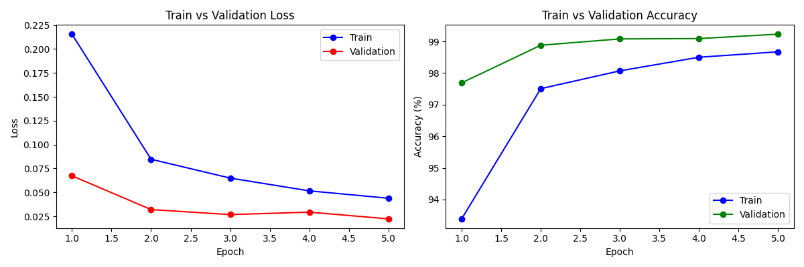
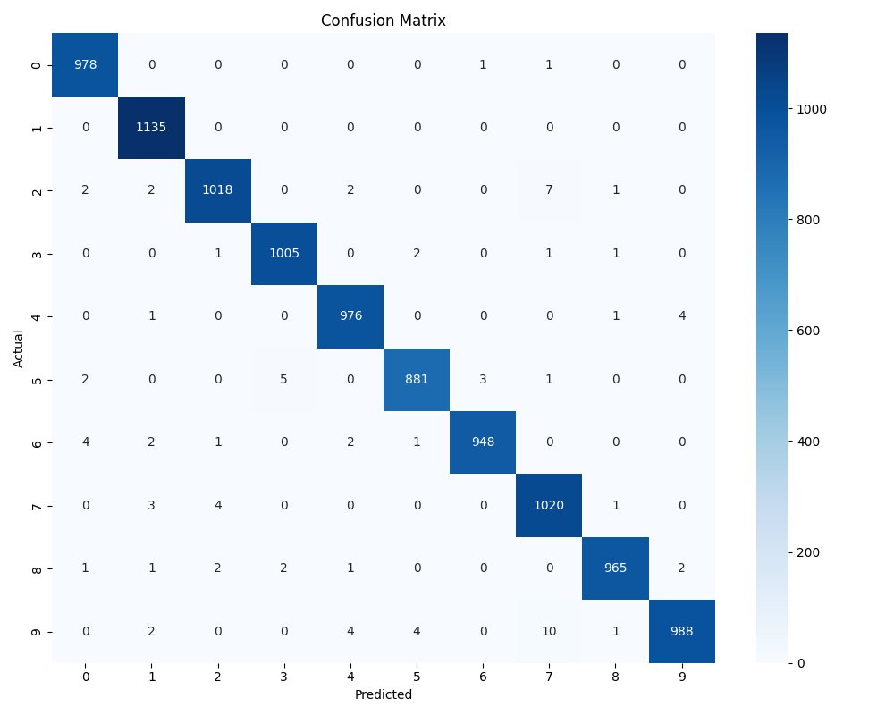
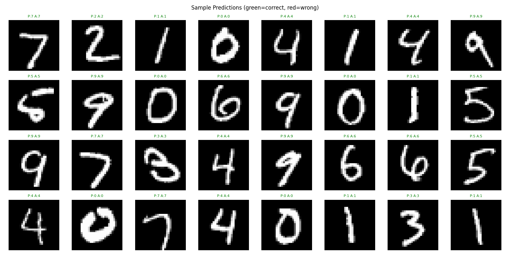
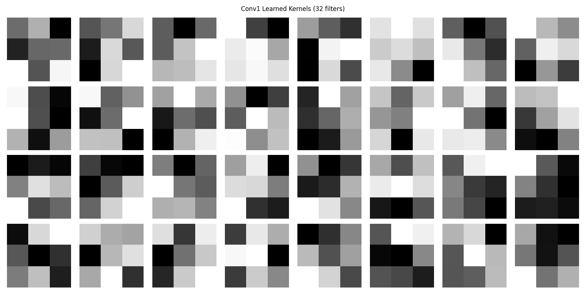
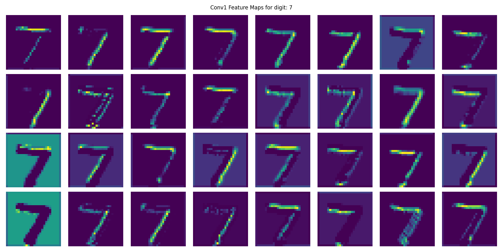

# 🧠 MNIST Digit Classifier — CNN from Scratch

A convolutional neural network built from scratch in PyTorch to classify handwritten digits from the MNIST dataset. This project focuses on understanding core CNN concepts including kernels, padding, convolution, activation functions, learned features, and loss functions.


---

## 📊 Results

### Training Curves


### Confusion Matrix


### Sample Predictions


### Learned Kernels


### Feature Maps


---

## 🏗️ Architecture
Input (1×28×28)
→ Conv2d(1, 32, 3×3, padding=1) → ReLU → MaxPool(2×2)
→ Conv2d(32, 64, 3×3, padding=1) → ReLU → MaxPool(2×2)
→ Flatten
→ Linear(3136, 128) → ReLU → Dropout(0.5)
→ Linear(128, 10)

| Layer | Output Shape | Parameters |
|---|---|---|
| Input | 1×28×28 | 0 |
| Conv1 + ReLU + Pool | 32×14×14 | 320 |
| Conv2 + ReLU + Pool | 64×7×7 | 18,496 |
| Flatten | 3136 | 0 |
| FC1 + ReLU + Dropout | 128 | 401,536 |
| FC2 (Output) | 10 | 1,290 |
| **Total** | | **421,642** |

---

## 🔑 Key Concepts Covered

- **Convolution** — sliding a kernel over an image to detect local features
- **Kernels** — small learnable filters (3×3) that detect edges, curves, and patterns
- **Padding** — preserving spatial dimensions by adding zeros around the border
- **MaxPooling** — downsampling spatial dimensions by taking the max in each region
- **ReLU** — activation function that kills negative values, introducing non-linearity
- **Dropout** — randomly zeroing neurons during training to prevent overfitting
- **CrossEntropyLoss** — loss function that measures how wrong the predicted probabilities are
- **Adam Optimizer** — adaptive learning rate optimizer used to update weights via backprop
- **Learned Features** — visualized conv1 kernels and feature maps showing what the model detects

---

## 📁 Project Structure
mnist-cnn-pytorch/
├── README.md
├── requirements.txt
├── .gitignore
├── notebooks/
│   └── exploration.ipynb
├── src/
│   ├── model.py        ← CNN architecture
│   ├── train.py        ← training loop + saves curves
│   ├── evaluate.py     ← confusion matrix + predictions
│   └── visualize.py    ← kernel + feature map visualizations
├── results/
│   ├── training_curves.png
│   ├── confusion_matrix.png
│   ├── sample_predictions.png
│   ├── misclassified.png
│   ├── kernels.png
│   └── feature_maps.png
└── checkpoints/
└── mnist_cnn.pth

---

## ⚙️ Setup

```bash
git clone https://github.com/JacobHailemariam/mnist-cnn-pytorch.git
cd mnist-cnn-pytorch
python -m venv venv
source venv/Scripts/activate
pip install -r requirements.txt
```

---

## 🚀 Usage

Train the model:
```bash
cd src
python train.py
```

Evaluate and generate prediction visuals:
```bash
python evaluate.py
```

Visualize learned kernels and feature maps:
```bash
python visualize.py
```

---

## 📈 Performance

| Metric | Value |
|---|---|
| Test Accuracy | 99.1% |
| Total Parameters | 421,642 |
| Epochs | 5 |
| Batch Size | 64 |
| Optimizer | Adam (lr=0.001) |
| Loss Function | CrossEntropyLoss |

---

## 💡 What I Learned

Building this project gave me a concrete understanding of how CNNs actually work under the hood. I could see exactly how a 3×3 kernel slides across an image, why padding matters for keeping spatial dimensions consistent, and what "learned features" actually means — they are just optimized weights that happen to look like edge detectors after training. Visualizing the feature maps made it clear how early layers detect simple patterns while later layers combine them into more complex representations.

---

## 🔮 Next Steps

- Add batch normalization between conv layers
- Experiment with deeper architectures
- Try data augmentation to improve generalization
- Deploy the model as a simple web app where you can draw a digit and get a prediction

---

## 📄 License

MIT